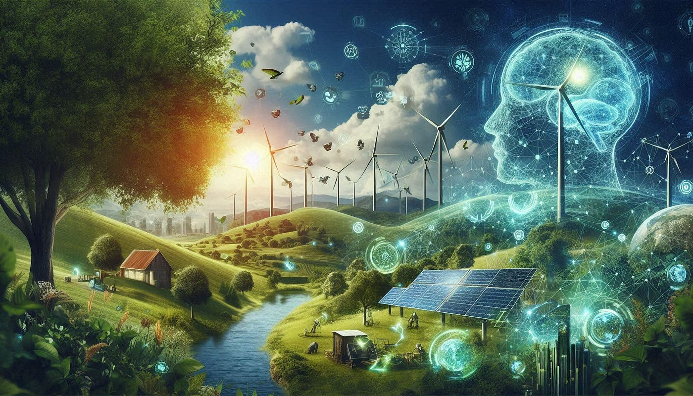
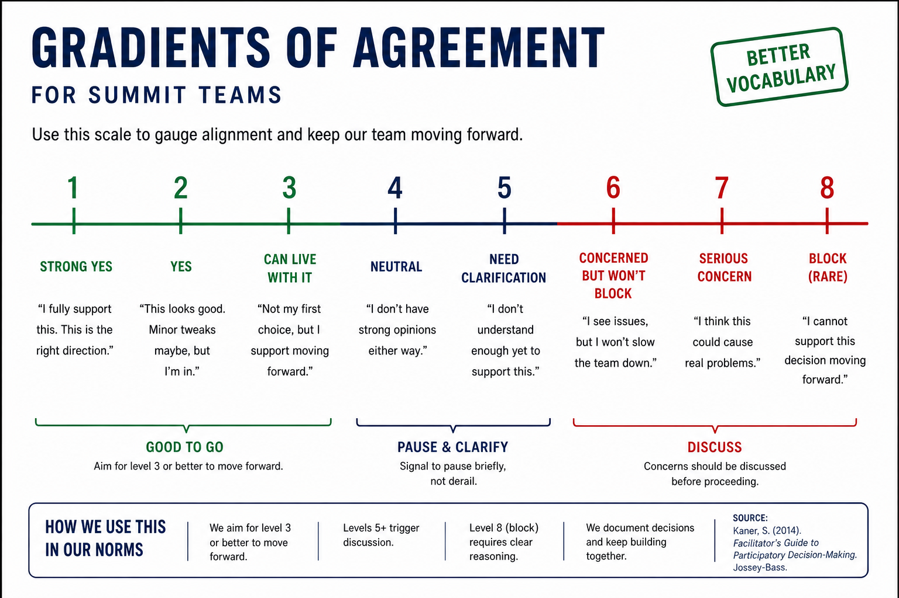
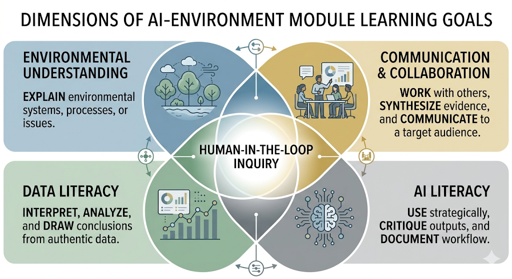
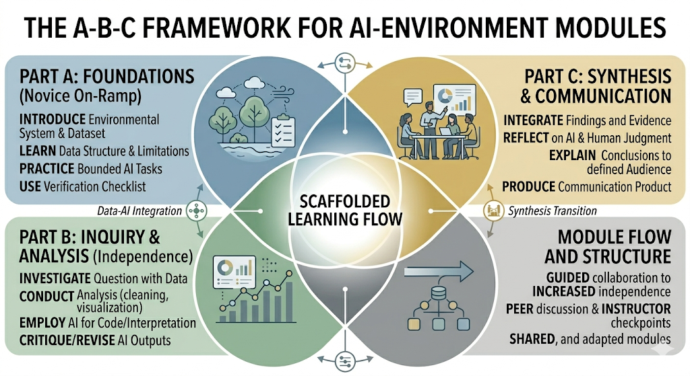

!!! tip "How to use this page during the Summit"
    - This page is your team’s shared workspace and final report-out page. It captures your group’s process and thinking throughout the Summit and will be used to share your work with others. 
    
    - Use this page as your team’s working record during the Summit and your final report-out.
    
    - The Summit has several different goals and thus you will use the page differently each day: Day 1 is for alignment, Day 2 is for building one useful thing, and Day 3 is for synthesis and report- out.
    
    - Look for the green buttons to indicate what you need to edit. 
    
    - Megaphones 📣 indicate which items you will be presenting during the end-of-day report-outs.

    - Only the items with megaphones will be visible when you hit the 'Summit Report Out' button. 

    - If you turn off 'Instructions' then you will only see the page content for public display.
    

# Team 7: AI and Education in Environmental Science

!!! note "Day 1 directions"
    AI and Education in Environmental Science

    [Edit Day 1 setup in Markdown](https://github.com/CU-ESIIL/Summit_group_2026_7/edit/main/docs/index.md?plain=1#L21){ .md-button target="_blank" rel="noopener" }

!!! tip "For ESIIL staff"
    Group Number: 7
    
    Breakout Room #: S340

    [ESIIL staff edit in Markdown](https://github.com/CU-ESIIL/Summit_group_2026_7/edit/main/docs/index.md?plain=1#L28){ .md-button target="_blank" rel="noopener" }
    

!!! note "How to replace the image above"
    Upload an image that represents your project and welcome people to your page. 
    
    Upload your own image to `docs/assets/hero/` and replace the file named `hero.png`. Use a wide image if you can, then refresh the site preview to check how it looks.
    Keep the file path `docs/assets/hero/hero.png` if you want the Markdown above to keep working.

    [Open image folder for changing image](https://github.com/CU-ESIIL/Summit_group_2026_7/tree/main/docs/assets/hero){ .md-button target="_blank" rel="noopener" }

[See a completed example](example.md){ .md-button }

## People { #people .oasis-report-out-context }

!!! note "Day 1 task"
    Get to know your team: share your cards (5-7 mins). Update your team roster (2-3 min).

    Use the in-person name cards to guide quick introductions.

    | Name card prompts | Follow-up notes |
    |---|---|
    |  |  |

    [Edit People in Markdown](https://github.com/CU-ESIIL/Summit_group_2026_7/edit/main/docs/index.md?plain=1#L63){ .md-button target="_blank" rel="noopener" }

| Name | Affiliation | Contact | Github |
|---|---|---|---|
|Jennifer Kovacs | Agnes Scott College | jkovacs@agnesscott.edu | echinodermatamata|
|James Watling|John Carrol University|jwatling@jcu.edu |jwatling |

## Team Norms and Decision Making { #team-norms-and-decision-making }

!!! note "Day 1 task"

    Suggested Self-Facilitation Instructions:
    
    - Round Robin: Everyone shares 1 norm that they think will be important for their team during the Summit and perhaps following the Summit (2 min).

    - After everyone has shared, make a list with as many norms as possible in GitHub (5–7 min).

    - Vote on your top 3 ideas. (Each person gets 3 votes; you can use all your votes on 1 idea or spread them out) (2 min).

    - In GitHub, move all team norms with votes to the top of the list.

    | Gradients of agreement | 
    |---|
    |  | 

    [Edit Team Norms in Markdown](https://github.com/CU-ESIIL/Summit_group_2026_7/edit/main/docs/index.md?plain=1#L87){ .md-button target="_blank" rel="noopener" }

Our team norms:

- Get all ideas on the table but don't be afraid to express a contradictory opinion
- Norms are an ongoing conversation
- Group decision making
- Respect individual and collective timelines and availability
- Discuss & disclose use of AI

Our decision making strategy:

Given our small group size, we expect to make decisions by mutual agreement (to be revisted if/as group evolves)

## Our product(s) 📣 { #product-direction .oasis-report-out-section .oasis-report-out-day2 }

!!! note "Day 2 Tasks"
    Morning Focus: questions, hypotheses, context; add at least one visual (photo of whiteboard/notes)

    Afternoon Focus: try a few datasets and analyses. Keep it visual, keep it simple. Update the site to reflect what you test. 

    [Edit content below here in Markdown](https://github.com/CU-ESIIL/Summit_group_2026_7/edit/main/docs/index.md?plain=1#L106){ .md-button target="_blank" rel="noopener" }

Short term:

Create the framework for AI and Environmental Science modules. Focus on the skill-building aspects of AI use in environmental science.
Build an example of a module that fits this template to demonstrate how to teach AI along with data inquiry and exploration 

Long term:

- Recruit instructors to form a working group and build their own modules and case uses at the QUBES BIOME summer meeting in June
- Teach an AI module using Colab & Gemini & NEON's flux data in the next academic year 
- Plan for an ESIIL working group to connect more faculty with content experts to create teaching modules for AI and Env Sci

## Our question(s) 📣 { #project-question .oasis-report-out-section .oasis-report-out-day2 }

Defining features of our module development:
Each module in the network should include five core elements:
An environmental theme, such as carbon cycling, water quality, biodiversity, land-use change, environmental justice, or ecosystem resilience.
A data component built around authentic datasets, ideally from open or shared sources that can support cross-course or cross-institution use.
An AI-facilitated component in which students use AI to support tasks such as question generation, code drafting, pattern identification, summarization, visualization, or interpretation.
A human-in-the-loop structure in which student and instructor judgment are required at each stage, especially when evaluating AI-generated claims, code, or interpretations.
A synthesis and communication component in which students explain findings to an audience such as classmates, community members, decision-makers, or other researchers.

Module design principles
All modules in the network should be built around the following principles:
Question-driven inquiry: Each module begins with an environmental question that is scientifically meaningful and suitable for student investigation using available data.
Authentic data use: Students work with real environmental data rather than toy examples so that they experience uncertainty, variation, and limits of interpretation.
Scaffolded independence: The module should move from guided work to greater student independence, following the EDDIE logic that early activities provide structure and later activities increase student choice and responsibility.
Human oversight of AI: AI use must never stand alone; students should document prompts, inspect outputs, verify claims, and revise work based on disciplinary evidence.
Communication as synthesis: The end point of the module is not only analysis, but communication of evidence-based conclusions in an audience-appropriate form.
Adaptability: Instructors should be able to teach the full module, shorten it, or substitute a local dataset or tool without changing the core learning goals.

##Intentions

Create a collection of modular teaching modules that teaches good AI practices along with data inquiry

All modules share four overarching learning goals emphasizing content knowledge, data literacy, AI skills, and communication:

All modules share a common structure, beginning with an introduction to the environmental theme for the module, leading to a guided inquiry component where both data literacy and AI collaboration are emphasized, and ending with synthesis/reflection and communication component:

[Download Word Document]([docs/assets/examples/Module%20Template%20Description.docx]

[Download Word Document]([docs/assets/examples/Module%structure%A-B-C.docx]

In-progress example module: The Carbon Remix: scaling carbon insights with an AI collaborator

## Why this matters (the “upshot”) 📣 { #why-this-matters .oasis-report-out-section .oasis-report-out-day2 }

This matters because:

It keeps human scientific judgment at the center by starting from trusted datasets and using AI tools to explain and modify code, which foregrounds verification, uncertainty, and reproducibility.

Links AI literacy to core disciplinary outcomes (carbon cycling, data skills, communication) and to the environmental footprint of computation itself via prompt/energy tracking, so students learn to treat AI use as a choice with trade‑offs.

People who could use this:

Environmental science, ecology, and sustainability faculty who want to integrate AI into existing data‑rich labs (NEON, flux, water quality, biodiversity) without rebuilding their courses from scratch.

## Data sources we’re exploring 📣 { #data-exploration .oasis-report-out-section .oasis-report-out-day2 }

!!! note "data exploration"
    Provide a snapshot showing some initial data patterns. 

    Add 2-4 promising data sources (links +1-line notes)    

*Snapshot showing initial data patterns.*

Promising data sources:

- [Data source 1](#): ...
- [Data source 2](#): ...
- [Data source 3](#): ...
- [Data source 4](#): ...

## Methods/technologies we’re testing 📣 { #methods-and-code .oasis-report-out-section .oasis-report-out-day2 }

!!! note "methods"
    Add 2-4 methods/technologies we're testing (stats, models, viz).

[View shared code](https://github.com/CU-ESIIL/Summit_group_2026_7/tree/main/code){ .md-button }

Methods/technologies we are testing:

| Method or technology | What we tested | Early note |
|---|---|---|
| ... | ... | ... |
| ... | ... | ... |
| ... | ... | ... |
| ... | ... | ... |

### Challenges identified

- ...
- ...

### Visuals

### Next Steps

Short term: 

Long term: 

!!! note "Day 3 Tasks"
    Sythesis: highlight 2-3 visuals that tell the story; keep text crisp. Practice a 6-minute walkthrough of the homepage. Why -> Questions -> Data/Methods -> Findings -> Next 

    [Edit content below here in Markdown](https://github.com/CU-ESIIL/Summit_group_2026_7/edit/main/docs/index.md?plain=1#L203){ .md-button target="_blank" rel="noopener" }

## Team Photo { #team-photo }

*Team members and collaborators who contributed to this project.*

## Findings at a glance 📣 { #findings-at-a-glance .oasis-report-out-section .oasis-report-out-day3 }

Headline 1 — what, where, how much

...

Headline 2 — change/trend/contrast

...

Headline 3 — implication for practice or policy

...

## Visuals that tell a story 📣 { #story-visuals .oasis-report-out-section .oasis-report-out-day3 }

*Visual 1: the main pattern or output we want people to remember.*

## What’s next? 📣 { #whats-next .oasis-report-out-section .oasis-report-out-day3 }

Short term:

- ...

Long term:

- ...

Who should see this next

- ...

## Cite & Reuse { #cite-reuse }

If you use these materials, please cite:

Summit Team. (2026). *Summit Group 2026 Team 7 — Innovation Summit 2026*. https://github.com/CU-ESIIL/Summit_group_2026_7

License: CC-BY-4.0 unless noted. 
